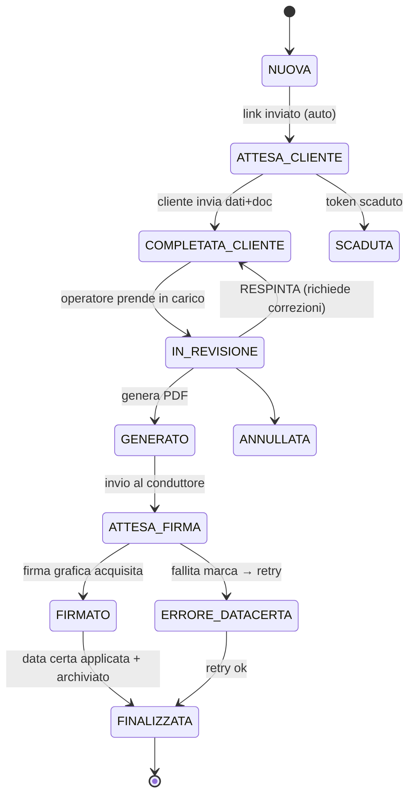
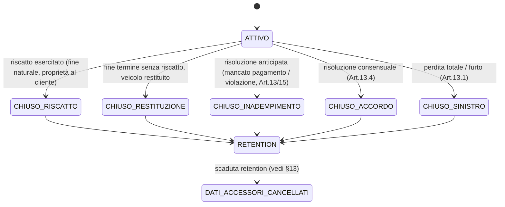
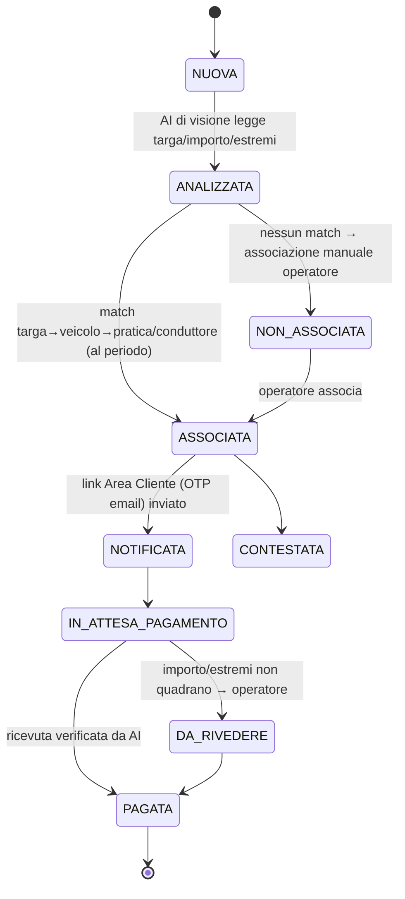

# PIANO DI PROGETTO — Sistema generazione contratti Rent To Buy

> Sistema che si integra con **Perfex CRM** per generare automaticamente contratti
> **Rent To Buy** di veicoli, con raccolta dati dal cliente, firma del conduttore e
> **data certa** (marca temporale qualificata + contrassegno) valida anche per un
> controllo di polizia.

Stato: **documento di pianificazione**. Nessun codice applicativo ancora scritto.

---

## 1. Glossario

| Termine | Significato |
|---|---|
| **Locatore** | Azienda che noleggia/vende il veicolo (es. Revonet Holding SE). È il **tenant** del sistema. |
| **Conduttore** | Il cliente (azienda o persona) che stipula il contratto. In Perfex è il *client*. |
| **Conducente** | Persona fisica autorizzata a guidare (principale + aggiuntivi). Ha patente e documenti. |
| **Pratica** | L'unità di lavoro: una proposta accettata+pagata che diventa contratto. |
| **Data certa** | Marca temporale qualificata eIDAS + contrassegno elettronico (QR) sul PDF. |
| **Delega alla guida** | Pagina del contratto, una per conducente, valida al controllo di polizia. |

---

## 2. Obiettivo e flusso d'insieme

Quando in Perfex una proposta **Rent To Buy** viene **accettata** e la relativa fattura
viene **marcata pagata**, il sistema:

1. riceve l'evento, crea una **Pratica** importando i dati disponibili;
2. invia **automaticamente** al cliente un link per compilare conducenti, patenti,
   caricare documenti (patente, identità, visura) e aggiungere autisti;
3. verifica/corregge i dati azienda (visura camerale via OpenAPI — **fa fede la visura**);
4. permette agli **operatori** di agganciare il veicolo dalla flotta, correggere i dati
   incerti e generare il **contratto PDF**;
5. fa **firmare** il conduttore;
6. applica la **data certa** (OpenAPI) e archivia il PDF finale.

```mermaid
flowchart LR
  P[Perfex: proposta accettata + fattura pagata] -->|webhook HMAC| W[API NestJS]
  W --> PR[Pratica: NUOVA]
  PR -->|email automatica| L[Portale cliente]
  L --> C[Conducenti + patenti + documenti + visura]
  C --> R[Operatore: veicolo flotta + correzioni]
  R --> G[Genera contratto HTML→PDF]
  G --> F[Firma grafica conduttore]
  F --> D[Data certa OpenAPI]
  D --> A[(Archivio MinIO)]
```



---

## 3. Architettura di sistema

### 3.1 Topologia container

```
                       [ reverse-proxy / TLS  (Traefik o nginx) ]
                          │            │              │
   ┌──────────────┐       │            │              │
   │   perfex     │──hook─►│            │              │
   │ (PHP/MySQL)  │  webhook            │              │
   └──────────────┘       ▼            ▼              ▼
                     [ api (NestJS) ] [ portal ]  [ admin ]
                          │  │  │      (Next.js)  (Next.js / Metronic)
            ┌─────────────┘  │  └───────────────┐
            ▼                ▼                  ▼
     [ app-db Postgres ] [ redis (BullMQ) ]  [ minio (S3) ]
```

| Container | Ruolo |
|---|---|
| `perfex` + `perfex-mysql` | Lo stack Perfex con il suo DB nativo. Ospita il modulo custom (hook). |
| `api` | Backend **NestJS**: webhook, dominio, code, integrazioni, REST/Auth. |
| `app-db` | **PostgreSQL**: dati applicativi (multi-tenant). |
| `redis` | Coda job **BullMQ** (webhook async, email, generazione PDF, chiamate OpenAPI con retry). |
| `minio` | **Storage S3** self-hosted: documenti caricati e PDF (con presigned URL). |
| `portal` | **Next.js**: portale pubblico del cliente (link tokenizzato). |
| `admin` | **Next.js + tema Metronic**: pannello operatori/admin. |
| `reverse-proxy` | Terminazione TLS, routing, sicurezza perimetrale. |

> `portal` e `admin` possono essere **un'unica app Next.js** con route pubbliche
> (`/p/[token]`) e route protette (`/admin/...`), oppure due app separate. Vedi
> `PANNELLO-ADMIN-UI.md`.

### 3.2 Stack tecnologico

- **Backend:** NestJS (TypeScript), Prisma o TypeORM su PostgreSQL, BullMQ su Redis.
- **Frontend admin:** Next.js + **Metronic** (Tailwind/React).
- **Frontend portale cliente:** Next.js.
- **Storage:** MinIO (SDK S3).
- **PDF:** rendering HTML→PDF (Puppeteer/Playwright headless Chromium).
- **Integrazioni:** **OpenAPI** (data certa, visure, firma), **SMTP** (email), **provider SMS**
  astratto/configurabile (solleciti), **provider AI di visione** configurabile (OCR multe +
  verifica ricevute di pagamento).

---

## 4. Multi-tenancy e controllo accessi (RBAC)

- **Tenant = Locatore.** Il **superadmin** crea/gestisce i Locatori.
- **Utenti globali**, assegnati a **uno o più Locatori**. Di norma gli stessi operatori
  lavorano su più Locatori; l'accesso di un utente può essere **limitato** a specifici Locatori.
- **Ruoli dinamici** con **matrice permessi** gestita dal pannello. Set di default seedato.
- **Scoping dati:** pratiche, flotta, contratti, template e impostazioni d'azienda sono
  *scoped* sul Locatore. Ogni query è filtrata per `locatore_id` del contesto attivo.

**Permessi (catalogo iniziale, estendibile):**
`settings.manage`, `locatori.manage`, `users.manage`, `roles.manage`,
`fleet.manage`, `pratiche.view`, `pratiche.edit`, `contract.generate`,
`contract.sign.manage`, `datacerta.apply`, `documents.verify`, `audit.view`,
`templates.manage`, `integrations.manage`, `fines.manage`, `fines.verify`,
`reminders.manage`, `contract.close`.

**Ruoli default seedati:** *Super Admin* (tutto, cross-tenant) · *Amministratore Locatore*
· *Operatore* · *Sola lettura / Auditor*.

---

## 5. Integrazione con Perfex

### 5.1 Modulo custom (hook)
Modulo CodeIgniter installato in Perfex che aggancia gli **action hook**:

- su **pagamento registrato** (`after_payment_added` / cambio stato fattura a *Paid*);
- (verifica incrociata) la proposta collegata risulta **accettata**.

Quando **entrambe** le condizioni sono vere, invia **un solo** webhook firmato (HMAC) al
nostro `api`, con `proposal_id`, `invoice_id`, `client_id` e i dati chiave.

### 5.2 Trigger e collegamenti (verificati sul DB reale)
- Collegamento nativo proposta↔fattura: **`tblproposals.invoice_id`** (1 fattura "iniziale" per proposta).
- Fattura pagata: record in `tblinvoicepaymentrecords` + stato fattura (soglia §5.5).
- Proposta accettata: `acceptance_date` / `signature` valorizzati.

**Il hook si attiva SOLO se valgono TUTTE queste condizioni:**
1. la fattura pagata è **l'iniziale di una proposta** → `invoice.id == proposta.invoice_id`;
2. quella proposta è **RTB** (§5.3) ed **accettata**;
3. **non** esiste già una pratica per quella proposta (idempotenza §5.4);
4. la fattura **non** è **ricorrente** (`is_recurring_from` / `recurring` valorizzati).

### 5.2b Fatture da NON prendere come trigger (analisi DB)
> **Perché serve il filtro:** nel DB ci sono **113 fatture** ma solo **58 proposte RTB** e
> ~**111 pagamenti** registrati. Attivare il hook su ogni "fattura pagata" creerebbe molti
> **falsi avvii**. La categoria di gran lunga più numerosa tra gli item di fattura sono i
> **canoni ricorrenti** (~96: *Monthly/Quarterly rental, pronájem, Fakturujeme…*).

Da **escludere sempre** (sono fatture pagate ma non avvii di contratto):
- **canoni mensili/trimestrali ricorrenti** (emessi durante il contratto attivo);
- fatture di **vendita diretta**, **riscatto**, **assicurazione**, **riparazioni/trasporto**,
  **management fee**, **delega** (€), **marca temporale** (€);
- fatture **non collegate** ad alcuna proposta.

Tutte queste restano escluse "per costruzione" dalla regola *“solo `proposta.invoice_id` di una
proposta RTB accettata”*, rafforzata dal controllo difensivo sulla **ricorrenza** della fattura.

### 5.3 Quali proposte processare (RTB vs vendita)
Classificazione **per voci di proposta** (`tblitemable`):

| Tipo | Segnale | Azione |
|---|---|---|
| **Rent To Buy** | ha l'item *“Monthly car rental / Canone di noleggio mensile”* | **processa** |
| **Vendita diretta** | ha l'item *“An used car sale”* (subject “Vendita…”) | fuori scope (template futuro) |
| **Výkup** (riacquisto) | item *“Výkup …”* | **ignora** |

> La regola (descrizione item che identifica il canone) è **configurabile** da impostazioni,
> non hardcoded.

### 5.4 Idempotenza
Tabella `webhook_event` con chiave esterna univoca dell'evento: un evento già processato
non genera una seconda pratica. Il webhook risponde subito `202`, l'elaborazione è in coda.

### 5.5 Soglia di trigger (pagamento)
Configurabile da impostazioni: avvio alla **fattura saldata** (totale, *default*) oppure al
**primo acconto** registrato. Perfex ammette pagamenti parziali, quindi la soglia è esplicita.

### 5.6 Reconciliation (rete di sicurezza)
Se l'API è irraggiungibile quando Perfex spara l'hook, l'evento andrebbe perso. Un **job
periodico** confronta Perfex (proposte **RTB accettate + pagate** secondo soglia) con le
pratiche esistenti e **recupera gli eventi mancanti**. Frequenza configurabile.

---

## 6. Macchina a stati della Pratica



> L'arricchimento del veicolo (flotta) e la verifica dati possono avvenire **in parallelo**
> mentre il cliente compila; il gate `IN_REVISIONE → GENERATO` richiede entrambe complete.

### 6.1 Ciclo di vita post-firma e chiusura del contratto

Dopo `FINALIZZATA` il contratto è **ATTIVO** per la durata (es. 12 mesi). La **chiusura**
avviene per uno di questi **motivi**, ognuno con effetti diversi:



- Durante l'**ATTIVO**: canoni mensili (fatturati su Perfex), promemoria **scadenza
  contratto**, gestione del **riscatto** (la parte "Buy"; es. i 738€ a fine 12 mesi).
- Alla **chiusura** si registrano **data + motivo**: questo **avvia il conto della retention**
  (§13). La chiusura è registrata dall'operatore (`contract.close`) o derivata da Perfex (es.
  fattura di riscatto pagata) — **configurabile**.

---

## 7. Modello dati PostgreSQL (entità principali)

### 7.1 Tenancy & accesso
- **locatore** — `id, ragione_sociale, sede_legale, paese, piva, cf, iban, swift, banca, logo_url, timbro_firma_url, legale_rappresentante_nome, legale_rappresentante_qualita, legale_rappresentante_firma_url, base_url_admin, base_url_portale, base_url_area, attivo, ...`
- **user** — `id, email, nome, password_hash, is_superadmin, attivo, ...`
- **role** — `id, locatore_id?(null=globale), nome, descrizione`
- **permission** — `id, codice, descrizione` (catalogo seedato)
- **role_permission** — `role_id, permission_id`
- **user_locatore** — `user_id, locatore_id, role_id` (assegnazione + scope)

### 7.2 Configurazione
- **setting** — `id, locatore_id?(null=globale), chiave, valore(jsonb), tipo` (override per-Locatore)
- **template** — `id, locatore_id, tipo(contratto|condizioni|delega|email_*), nome, versione, html, attivo, created_at`

### 7.3 Integrazione Perfex
- **perfex_connection** — `id, locatore_id, base_url, modalita, webhook_secret, attivo`
- **webhook_event** — `id, locatore_id, tipo, external_id(unique), payload(jsonb), stato, errore, processed_at`

### 7.4 Flotta
- **veicolo** — `id, locatore_id, targa(unique x locatore), marca, modello, modello_esteso, condizioni, motorizzazione, carburante, telaio_vin, euro, anno, note, attivo`

### 7.5 Dominio contratto
- **pratica** — `id, locatore_id, stato, tipo, perfex_proposal_id, perfex_invoice_id, perfex_client_id, rif_operazione, veicolo_id?, snapshot_conduttore(jsonb), conduttore(jsonb), firmatario_nome, firmatario_qualita, economia(jsonb: canone, durata_mesi, acconto, sip, fee_marca, riscatto, km_inclusi, extra_km, totale), vies, data_inizio, data_fine, stato_post(ATTIVO|CHIUSO), motivo_chiusura, data_chiusura, retention_scadenza, created_at, updated_at`
- **conducente** — `id, pratica_id, tipo(principale|aggiuntivo), nome, cognome, data_nascita, indirizzo, comune, prov, patente_numero, patente_rilascio, patente_scadenza, patente_luogo, completato`
- **documento** — `id, pratica_id, conducente_id?, tipo(patente_fronte|patente_retro|identita_fronte|identita_retro|visura|contratto_base|contratto_firmato|contratto_datacerta), storage_key, mime, dimensione, hash_sha256, caricato_da, verificato, created_at`
- **access_token** — `id, pratica_id, token_hash, scopo(compilazione|firma), scadenza, usato_at, ip`
- **contratto** — `id, pratica_id, versione, numero_interno, storage_base, storage_firmato, storage_datacerta, hash, firma_metodo, firma_at, datacerta_provider, datacerta_request_id, datacerta_numero, datacerta_at, created_by`
- **verifica_dato** — `id, pratica_id, fonte(visura|openapi), campo, valore_origine, valore_corretto, azione(confermato|corretto), at`
- **audit_log** — `id, locatore_id, user_id, azione, entita, entita_id, dettaglio(jsonb), ip, at`

### 7.6 Solleciti, Multe, Area Cliente
- **reminder_log** — `id, pratica_id, canale(email|sms), tentativo_n, esito, link_token_id, at`
- **multa** — `id, locatore_id, veicolo_id?, pratica_id?, conduttore_id?, file_storage_key, ocr(jsonb), targa_rilevata, numero_verbale, importo, ente, data_violazione, scadenza_pagamento, stato, caricata_da, created_at`
- **multa_pagamento** — `id, multa_id, file_storage_key, ocr(jsonb), verifica_ai(jsonb), stato(verificato|da_rivedere), created_at`
- **cliente_accesso** — `id, locatore_id, conduttore_ref, email, magic_token_hash, attivo, created_at` (Area Cliente persistente)
- **otp_code** — `id, accesso_id, codice_hash, scadenza, usato_at, tentativi`

### 7.7 Ciclo di vita, storico e notifiche
- **veicolo_assegnazione** — `id, veicolo_id, pratica_id, dal, al?` (storico **datato**: serve al match multe "del periodo" quando il veicolo cambia conduttore)
- **notifica_interna** — `id, locatore_id, user_id?, tipo, entita, entita_id, letta, created_at`
- **consenso** — `id, pratica_id, tipo(informativa_privacy), versione, accettato_at, ip`

---

## 8. Mappatura campi contratto → fonte dati

| Sezione contratto | Campo | Fonte |
|---|---|---|
| **Locatore** | ragione sociale, sede, P.IVA, C.F., IBAN, timbro | **Impostazioni Locatore** |
| **Conduttore** | rag. soc., indirizzo, P.IVA, email, tel | **Perfex `tblclients`** (cliente fattura), poi **verificato con visura** |
| **Conducente/i** | nome, nascita, indirizzo, patente n°/rilascio/scadenza/luogo | **Portale cliente** |
| **Veicolo** | targa, tipo (breve) | Perfex custom field (`proposal_targa_veicolo`, `proposal_tipo_veicolo`) |
| **Veicolo** | modello esteso, condizioni, motorizzazione, carburante, telaio/VIN, Euro | **Flotta** (operatore) |
| **Termini** | durata, km inclusi, extra km, riscatto | proposta `content` (prosa, **inaffidabile**) → **rivisto dall'operatore** |
| **Riepilogo economico** | canone, acconto, SIP, voce marca temporale | **Item proposta** (`tblitemable`) |
| **Riepilogo economico** | totale | **ricalcolato** (canone×durata + componenti) |
| **Coperture, condizioni generali, delega** | testo | **Template** (per Locatore) |

---

## 9. Generazione del contratto (HTML → PDF)

Composizione del PDF (pagine variabili in base ai conducenti):

1. **Frontespizio**: Locatore, Conduttore, Conducente principale, Veicolo, Termini, Coperture.
2. **Informazioni aggiuntive + Riepilogo economico + Coordinate bancarie.**
3. **Condizioni generali** (Art. 1–18) — da template.
4. **Delega alla guida** — **una pagina per ogni conducente** (principale + aggiuntivi).

Il template è HTML/CSS versionato e **gestito da impostazioni** (segnaposto sostituiti coi
dati della pratica). Render con Chromium headless. Il PDF “base” (non firmato) viene salvato
e mostrato in anteprima all'operatore/cliente.

> **Assunzioni di scope:** **un solo veicolo per pratica** (la targa è singola); contratto
> **bilingue IT/EN** (configurabile). I contratti multi-veicolo sono scope futuro.

---

## 10. Firma del conduttore

- **Metodo attivo:** **firma grafica nel portale** — il conduttore firma a schermo
  (dito/mouse), l'immagine viene apposta nel riquadro CONDUTTORE del PDF.
- Tracciamento: timestamp, IP, hash del documento firmato (valore probatorio dell'atto).
- **Firmatario:** se il conduttore è un'**azienda**, si cattura **chi firma** (nome + qualità,
  es. *legale rappresentante*), riportato nel riquadro CONDUTTORE del PDF.
- **Tre ruoli-persona distinti:** *firmatario* (chi firma per l'azienda) ≠ *conducente/i* (chi
  guida, con patente) ≠ *contatto* (email per link/Area Cliente, dal cliente Perfex,
  modificabile). Il conducente principale **può** coincidere col firmatario, ma non è garantito.
- **Configurabile:** il metodo è un'impostazione; upgrade futuro previsto = **FEA con OTP via
  OpenAPI**. La firma avviene **prima** della data certa.

---

## 11. Data certa (OpenAPI) — valida al controllo di polizia

- **Formato:** **marca temporale qualificata eIDAS** (QTSP accreditato AgID) **+
  contrassegno elettronico (QR)** apposto su pagina-certificato — come nel PDF d'esempio.
- **Perché così:** al posto di blocco la delega è mostrata **stampata**; solo il **QR**
  rende verificabile la copia cartacea (art. 23 CAD). Un PAdES “nudo” sarebbe invisibile su
  carta. La marca qualificata dà **data certa opponibile a terzi** (art. 41/42 Reg. 910/2014).
- **Provider:** **OpenAPI** (prodotto *Data Certa*). Credenziali da impostazioni (toggle).
- Il PDF **firmato** viene inviato a OpenAPI → si riceve il PDF con copertina+contrassegno →
  archiviato in MinIO → pratica `FINALIZZATA`.
- **Frequenza: una tantum alla firma** (scelta). La "marca temporale semestrale" citata nelle
  condizioni resta una **voce di fee amministrativa**, non una ri-marcatura periodica (modalità
  ricorrente eventualmente attivabile in futuro da impostazioni).

---

## 12. Visure e verifica dati (OpenAPI)

- Funzione **attivabile/disattivabile** da impostazioni (feature flag *visure*).
- Su P.IVA del conduttore si interroga l'**API visure OpenAPI** per ottenere dati azienda
  **strutturati e autorevoli**; si riconciliano con i dati Perfex e si **corregge
  automaticamente** (la **visura fa fede**). Ogni differenza è registrata in `verifica_dato`.
- La visura caricata dal cliente resta comunque **archiviata** per controllo.
- Per le **persone fisiche** non c'è visura: i dati si verificano contro il **documento
  d'identità** caricato.

**Validazioni dati (regole, configurabili come blocco o avviso):**
- **VIES**: controllo automatico della P.IVA UE → popola il campo `VIES (Si/No)` del contratto.
- Checksum **P.IVA / Codice Fiscale**, validazione **IBAN**.
- **Scadenza patente ≥ data fine contratto** per ogni conducente (altrimenti non valido per la durata).

---

## 13. Storage documenti (MinIO) e GDPR

- Documenti sensibili (patente, identità, visura) e PDF in **MinIO**, cifratura a riposo.
- Upload/download via **presigned URL** a breve durata (i file non transitano dal backend).
- **Consenso/informativa privacy** raccolti nel portale (con versione, timestamp, IP) → `consenso`.
- DB e MinIO non esposti pubblicamente; accesso solo via `api`; `audit_log` di ogni azione.

**Retention legata alla chiusura del contratto (§6.1):**
- Il conto della retention **parte dalla data di chiusura** (riscatto / restituzione /
  inadempimento / accordo / sinistro), non dalla firma.
- **Retention selettiva** — distinzione fondamentale:
  - **Documenti personali accessori** (patente, identità, visura) → **cancellati/anonimizzati**
    dopo la *retention da chiusura* (configurabile).
  - **Contratto firmato + data certa** → **conservazione legale** lunga (es. 10 anni): **non**
    eliminato con gli accessori (la data certa OpenAPI prevede già conservazione a norma).
- **Job di cancellazione** automatico: agisce **solo** su pratiche `CHIUSO` con retention scaduta,
  purga gli accessori e mantiene il contratto a norma.
- Gestione **richieste di cancellazione** (diritto all'oblio) con valutazione dei vincoli legali
  (un contratto ancora attivo o entro conservazione non è cancellabile).

---

## 14. Notifiche / email

- Email transazionali dal nostro `api` (SMTP da impostazioni): invio link compilazione,
  promemoria scadenza token, invito alla firma, conferma finalizzazione, **scadenza contratto**.
- Template email **gestiti da impostazioni** (per Locatore).
- **Notifiche interne agli operatori** (inbox in-app + email) → `notifica_interna`: cliente ha
  completato, **multa non associata**, firma effettuata, **data certa fallita**, **credito
  OpenAPI basso**, contratto in scadenza.

---

## 15. Impostazioni (“niente hardcoded”)

**Principio assoluto:** *tutta* la configurazione vive **nel database** ed è modificabile dal
pannello — **niente in `.env`**, niente costanti nel codice. Include **URL/sottodomini** (admin,
portale, area cliente), **endpoint e credenziali delle API** (OpenAPI, SMS, AI di visione, SMTP,
Perfex) e ogni parametro. **Unica eccezione di bootstrap** (inevitabile): la **stringa di
connessione al DB** e la **master key** per decifrare i segreti — servono *prima* di poter
leggere il DB, quindi arrivano dal runtime/secret manager, non come configurazione applicativa.

| Ambito | Globale | Per-Locatore |
|---|---|---|
| Profilo Locatore (dati, IBAN, timbro/firma) | | ✅ |
| Template contratto / condizioni / delega / email | | ✅ |
| Parametri economici (SIP, fee marca, extra-km default, durata default) | default | ✅ override |
| Feature flag (visure on/off, firma on/off + metodo) | default | ✅ override |
| Credenziali OpenAPI (data certa, visure, firma) | ✅ | ✅ override |
| SMTP | ✅ | ✅ override |
| Connessione Perfex + webhook secret | | ✅ |
| Scadenza link, retention, regola item RTB | default | ✅ override |
| Solleciti (on/off, canali email/SMS, pianificazione, max tentativi) | default | ✅ override |
| Provider SMS (driver + credenziali) | ✅ | ✅ override |
| Provider AI di visione (OCR multe + verifica pagamenti) | ✅ | ✅ override |
| Area Cliente (durata OTP, rate limit) | default | ✅ override |
| Soglia trigger pagamento (saldo totale / primo acconto) | default | ✅ override |
| Retention accessori (giorni da chiusura) + conservazione contratto (anni) | default | ✅ override |
| 2FA pannello (obbligatorio/opzionale), frequenza reconciliation | ✅ | ✅ override |
| **URL/sottodomini** pubblici (admin / portale / area cliente) | default | ✅ override |
| Legale rappresentante del Locatore (nome, qualità, firma) | | ✅ |

I default sono **seedati** in DB, mai cablati nei percorsi di codice; i **segreti** sono cifrati
a riposo (vedi §16). Nessuna configurazione in `.env`.

---

## 16. Sicurezza

- Webhook Perfex firmato HMAC + idempotenza.
- Token portale: opachi, monouso, a scadenza, scope-limited (compilazione/firma); Area Cliente con OTP.
- Auth pannello: JWT/refresh, RBAC con scoping per Locatore, audit log.
- **2FA** per il pannello operatori (configurabile obbligatorio/opzionale); gestione sessioni/revoca.
- **Segreti cifrati a riposo** (credenziali OpenAPI/SMS/AI, webhook secret) — non in chiaro nella
  tabella settings (envelope encryption / KMS).
- Validazione MIME/dimensione upload; antivirus opzionale.

---

## 17. Solleciti automatici (reminder)

Se il cliente non completa la compilazione, il sistema **rinvia automaticamente** il link.

- Configurazione da **Impostazioni → Solleciti & Notifiche** (per Locatore):
  abilita on/off, **canali** (email + **SMS**), **pianificazione** (primo sollecito dopo *N*
  giorni, ripeti ogni *M* giorni, **max** *K* tentativi), fascia oraria di invio.
- Se il token del link è **scaduto**, ne viene generato uno **nuovo** e incluso nel sollecito.
- **Implementazione:** job **BullMQ** ripetibile (cron) che scansiona le pratiche in
  `ATTESA_CLIENTE` oltre soglia, rispetta `max tentativi`, invia via **SMTP** + **provider SMS**
  configurabile, scrive su `reminder_log`/audit.
- I solleciti si **fermano** automaticamente al passaggio a `COMPLETATA_CLIENTE`.

---

## 18. Gestione multe

Modulo per smistare le multe dei veicoli (intestati al Locatore) al conduttore corretto.



**Flusso:**
1. Un **operatore** carica la multa (PDF/JPG) nella *zona multe*.
2. **AI di visione** (provider configurabile) estrae **targa**, n° verbale, **importo**, data
   violazione, **ente**, scadenza pagamento.
3. **Matching automatico**: targa → **veicolo (flotta)** → pratica/conduttore che aveva il
   veicolo **nel periodo** della violazione → associazione a utente/azienda. Se nessun match →
   `NON_ASSOCIATA` (associazione manuale).
4. **Notifica** al conduttore: link alla **Area Cliente** (vedi §19).
5. Il cliente carica la **ricevuta di pagamento** → **AI di visione** la verifica (importo /
   estremi) → multa `PAGATA`; se non quadra → `DA_RIVEDERE` (controllo operatore).

> Tutto l'OCR/AI è dietro un'interfaccia **provider configurabile** (chiavi da impostazioni,
> attivabile). Nessun fornitore hardcoded.

---

## 19. Area Cliente persistente

Area personale del conduttore, **distinta** dal link monouso di compilazione.

- Accesso **senza password**: il cliente apre il **magic-link persistente (senza scadenza)** →
  il sistema invia un **OTP via email** → sessione a breve durata.
- Contenuti: **documenti** caricati (patente, identità, visura), **stato pratica/contratto**,
  **multe** associate (importo, scadenza) e **upload ricevuta di pagamento**.
- Identità = conduttore/azienda (per email). L'area mostra **solo** i dati di quel conduttore.
- **Sicurezza:** OTP a scadenza breve, **rate limiting**, tentativi limitati, audit accessi.

---

## 20. Osservabilità, backup e i18n

- **Log strutturati** + **error tracking** (es. Sentry), **health/readiness** dei container.
- **Backup** schedulati di **PostgreSQL** e **MinIO**, con test di ripristino.
- **Reportistica/export** (contratti, multe, scadenze) e metriche operative.
- **i18n** del pannello e del portale (almeno **IT/EN**, coerente col contratto bilingue).

---

## 21. Punti ancora da confermare

1. **Credenziali OpenAPI** (data certa, visure, firma): ambiente test/prod disponibile?
2. Accesso a **installare il modulo** su quel Perfex (versione) e abilitare gli hook.
3. Una sola istanza Perfex condivisa o **una per Locatore**? (il modello prevede connessione per-Locatore).
4. Logica esatta di **ricalcolo del totale** e del **riscatto** (l'esempio diverge dalla proposta).
5. Periodo di **retention** legale dei documenti.

---

## 22. Fasi suggerite

1. **Fondamenta:** auth + RBAC + multi-tenant + impostazioni + seed + **2FA** + segreti cifrati.
2. **Integrazione Perfex:** modulo hook + webhook + import pratica + classificazione RTB + **reconciliation**.
3. **Portale cliente:** token, form conducenti, upload MinIO, **visura + validazioni (VIES, IBAN, patente)**.
4. **Flotta** (+ storico assegnazioni) **+ revisione operatore.**
5. **Generazione PDF** (template) + **firma grafica** (+ firmatario azienda).
6. **Data certa OpenAPI** + archivio.
7. **Solleciti automatici** (email/SMS, rigenerazione link) + **notifiche interne**.
8. **Gestione multe** (OCR/AI, matching) + **Area Cliente** persistente (OTP).
9. **Ciclo di vita & chiusura** (riscatto/restituzione/inadempimento) + **retention/cancellazione**.
10. **Hardening & ops:** audit, osservabilità, backup, i18n, reportistica.
